# Django Project - [Bike Rental Service] 🐍🛠

    The Bike Rental Service is a web-based platform designed to streamline the process of renting bikes online.
    Users can browse available bikes, make bookings, view testimonials, and complete payments using PayPal or eSewa.
    Bike hosts can submit their bikes for listing, and admins can manage the platform efficiently.

-----------------------------------------------------------------------------------------------------------------------

## Features ✨

    # Users
        -User Registration and Authentication (Token-based Authentication using JWT)
        -Browse and Search Bikes
        -Make a Booking with start and end dates
        -Payment Integration
        -View Testimonials and submit feedback
        -User Dashboard Access

    #Bike hosts
       - Bike host Registration
       - Bike Listing Submission (with document uploads: registration certificate, insurance certificate, ID proof, and bike photos)
       - Dashboard Access for managing listed bikes

    #Admin
       -Manage Bikes (approve/reject bikes submitted by hosts)
       -Manage Bookings and User Data
       -View Feedback and Testimonials

------------------------------------------------------------------------------------------------------------------------

## Technologies Used 🛠

# Backend:

    -Python
    -Django (including Django REST Framework - DRF)
    -PostgreSQL for database management
    -JWT Authentication for secure login

# Frontend:

    -HTML, CSS, Bootstrap 5
    JavaScript for interactivity

------------------------------------------------------------------------------------------------------------------------

## Payment Integration

    # PayPal:
        - The platform uses PayPal for secure online payments. Configure your PayPal credentials in the .env file.
    
    # eSewa:
         - The eSewa payment gateway allows users in Nepal to pay online. Set up the necessary merchant credentials and URLs.

------------------------------------------------------------------------------------------------------------------------

## Installation and setup 🛠 
    Follow these steps to run the project locally.

    1. Clone the Repository
    2. Create and Activate a Virtual Environment
    3. Install Requirements
    4. Set Up the Database
        PostgreSQL Configuration: Update the DATABASES setting in settings.py with your PostgreSQL credentials.
    5. Apply Migrations
    6. Create Superuser (Admin)
    7. Run the Development Server
        Access the app at: http://localhost:8000/
------------------------------------------------------------------------------------------------------------------------

## API Documentation 📄
    This project includes API documentation using Swagger and Redoc.

        Swagger: http://127.0.0.1:8000/api/swagger/
        Redoc: http://127.0.0.1:8000/api/redoc/

------------------------------------------------------------------------------------------------------------------------

## Directory Structure
    BikeRentalService/  
        |-- bookings/         # Booking app (models, views, serializers, URLs)  
        |-- bikes/            # Bike management app  
        |-- users/            # User authentication and management  
        |-- testimonial/      # User feedback and testimonials  
        |-- admin_panel/      # Admin-specific features  
        |-- media/            # Uploaded documents (e.g., bike photos, certificates)  
        |-- templates/        # HTML templates  
        |-- static/           # CSS, JS, images  
        |-- manage.py         # Django project entry point  

------------------------------------------------------------------------------------------------------------------------
## Endpoints 📄
---

### API Endpoints (JSON Responses)

#### Users App (Authentication, User, and host Management)
- **GET** `/accounts/google/login/` - Initiate Google OAuth login
- **POST** `/api/auth/login/` - API: JWT login (for mobile/spa)
- **POST** `/api/auth/logout/` - API: Logout
- **GET** `/api/user/` - Get the list of users  
- **GET** `/api/user/profile/` - Get user profile details  
- **GET** `/api/user/hosts/` - List all bike hosts  
- **GET** `/api/user/hosts/<int:pk>/` - Retrieve a bike host's details  
- **GET** `/api/user/dashboard/` - View user dashboard  
- **GET** `/api/user/dashboard/host/` - View bike host dashboard  
- **POST** `/api/user/contact/` - Send a contact message  
- **POST** `/api/user/bike-host-request/` - Request bike host verification  
- **GET** `/api/user/admin/bike-host-requests/` - Admin: View bike host requests  
- **GET** `/api/user/admin/bike-host-requests/<int:pk>/` - Admin: View specific bike host request  

---

#### Testimonials App (Feedback and Reviews)
- **GET** `/api/testimonial/` - List all testimonials  
- **GET** `/api/testimonial/<int:pk>/` - Retrieve a specific testimonial  
- **POST** `/api/testimonial/create/` - Create a new testimonial  
- **PUT** `/api/testimonial/<int:pk>/update/` - Update an existing testimonial  
- **DELETE** `/api/testimonial/<int:pk>/delete/` - Delete a testimonial  

---

#### Payment App (Payment Processing)
- **GET** `/api/payment/` - List all payments  
- **GET** `/api/payment/<int:pk>/` - Retrieve payment details  
- **POST** `/api/payment/paypal/<int:booking_id>/<str:amount>/` - Process PayPal payment  
- **POST** `/api/payment/esewa/<int:booking_id>/<str:amount>/` - Process eSewa payment  
- **GET** `/api/payment/esewa-success/` - eSewa payment success endpoint  
- **GET** `/api/payment/esewa-failure/` - eSewa payment failure endpoint  
- **GET** `/api/payment/paypal-return/` - PayPal payment success endpoint  
- **GET** `/api/payment/paypal-cancel/` - PayPal payment cancellation endpoint  
- **POST** `/api/payment/paypal-ipn/` - PayPal IPN endpoint for instant notifications  

---

#### Bookings App (Reservation Management)
- **GET** `/api/booking/` - List all bookings  
- **GET** `/api/booking/<int:pk>/` - Retrieve booking details  
- **POST** `/api/booking/create/` - Create a new booking  
- **PUT** `/api/booking/<int:pk>/update/` - Update an existing booking  
- **DELETE** `/api/booking/<int:pk>/delete/` - Delete a booking  
- **POST** `/api/booking/<int:pk>/payment-select/` - Select payment method for a booking  
- **POST** `/api/booking/<int:pk>/approve/` - Approve a booking (admin only)  
- **POST** `/api/booking/<int:pk>/reject/` - Reject a booking (admin only)  
- **POST** `/api/booking/<int:pk>/complete/` - Mark a booking as completed  

---

#### Bikes App (Bike Management)
- **GET** `/api/bike/` - List all bikes  
- **GET** `/api/bike/<int:pk>/` - Retrieve bike details  
- **POST** `/api/bike/create/` - Add a new bike (Bike host only)  
- **PUT** `/api/bike/<int:pk>/update/` - Update bike information  
- **DELETE** `/api/bike/<int:pk>/delete/` - Delete a bike  

---

#### Swagger & API Authentication
- **Swagger UI**: `/api/swagger/` - Interactive API Documentation  
- **ReDoc UI**: `/api/redoc/` - API documentation (Redoc format)  
- **API Authentication**: `/api-auth/` - Authentication endpoints for session-based login  

---

### Template-Based (HTML) Endpoints

#### Bikes App (HTML Views)
- **GET** `/bikes/` - View list of bikes   

---

#### Bookings App (HTML Views)
- **GET** `/bookings/` - View list of bookings

---

#### Testimonials App (HTML Views)
- **GET** `/testimonials/` - View list of testimonials

---

#### Users App (HTML Views)
- **GET** `/accounts/google/login/` - Seamless Google Login  
- **GET** `/users/login/` - Login page with Google support
- **GET** `/admin-panel/` - Custom Administrative Dashboard
- **GET** `/users/profile/` - View and update user profile  
- **GET** `/users/dashboard/` - View user dashboard  
- **GET** `/users/dashboard/host/` - View bike host dashboard  
- **POST** `/users/bike-host-request/` - Request bike host verification  

------------------------------------------------------------------------------------------------------------------------

# Screenshots 🌟

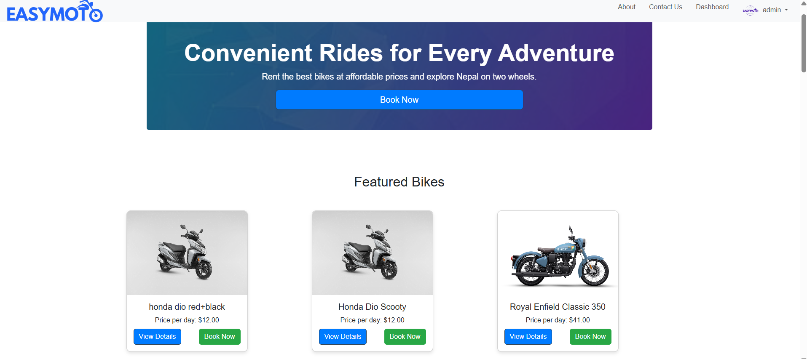
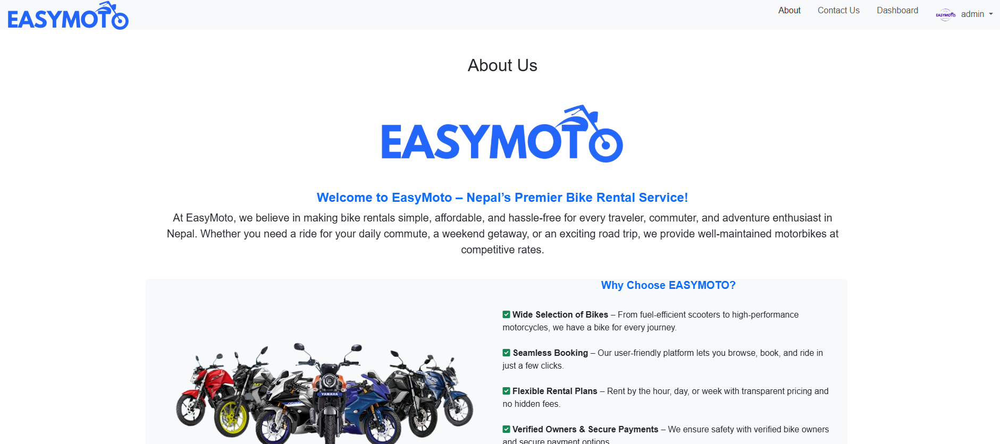
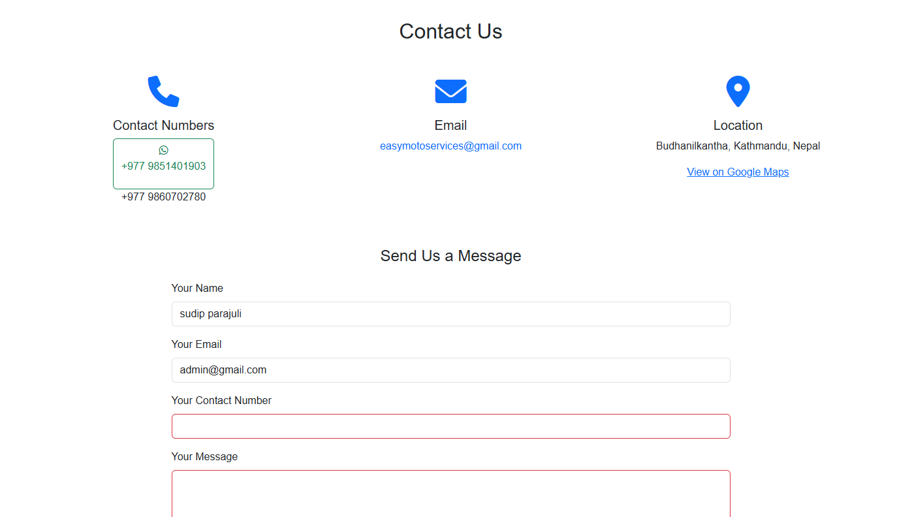
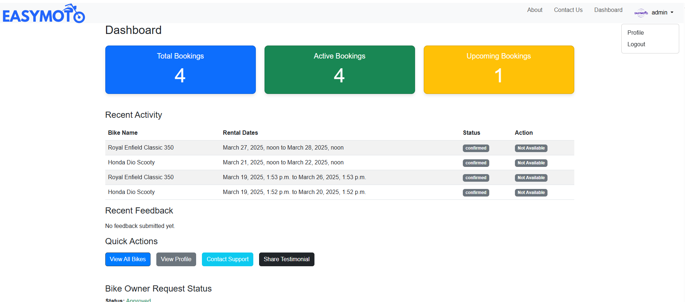
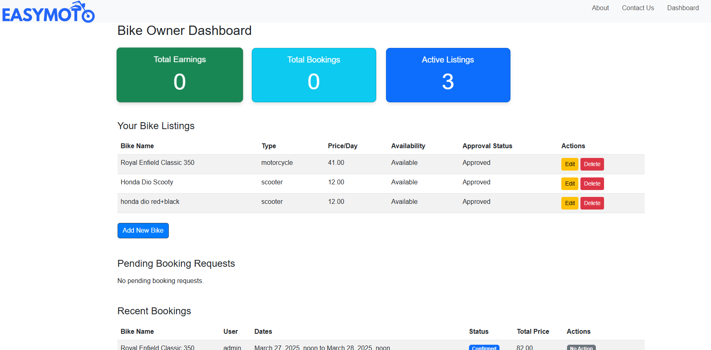
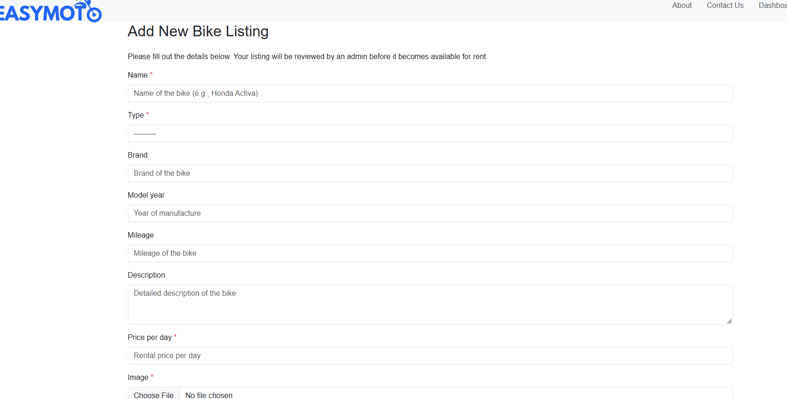
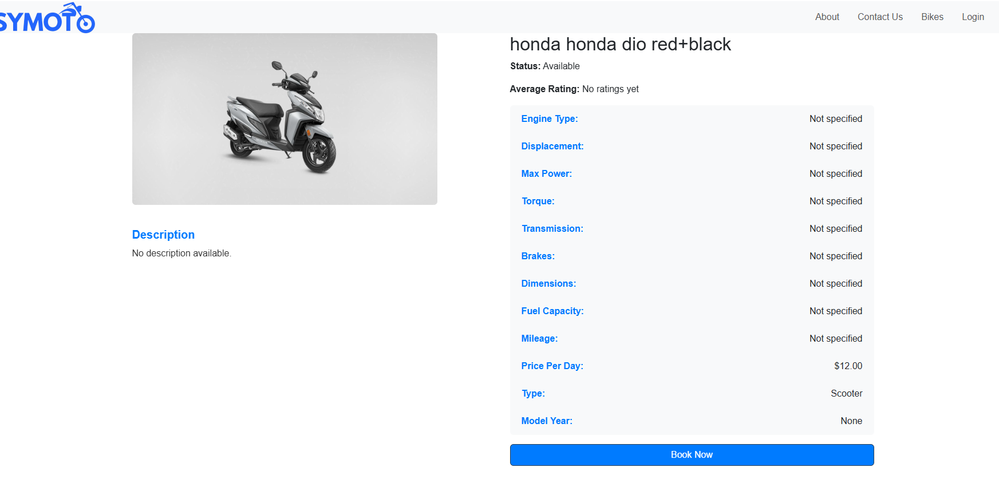
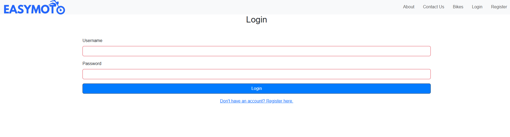
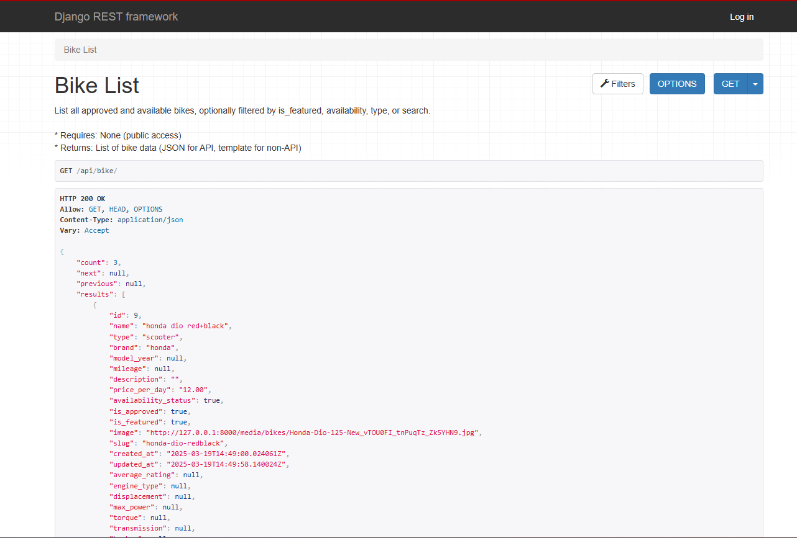
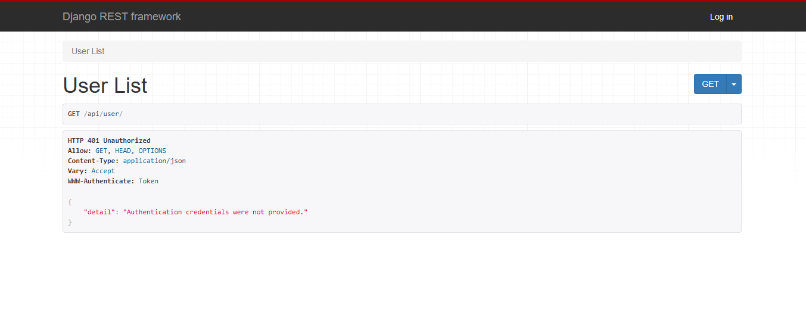
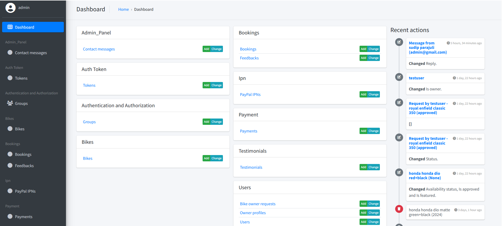
------------------------------------------------------------------------------------------------------------------------

# Contributing 🤝
    Contributions are welcome! If you'd like to contribute to the project:

        -Fork the repository.
        -Create a new branch: git checkout -b feature-name.
        -Make your changes and commit them: git commit -m 'Add some feature'.
        -Push to the branch: git push origin feature-name.
        -Submit a pull request.

------------------------------------------------------------------------------------------------------------------------

# Contact 📬
    For any questions, feel free to reach out:

    ## Project host: Sudip Parajuli

    Email: sparajuli802@gmail.com
    GitHub: https://github.com/sudip-parajuli
    LinkedIn: https://www.linkedin.com/in/sudip-parajuli-8073601a1/
    Twitter (X): https://x.com/sudip_parajuli

------------------------------------------------------------------------------------------------------------------------

# Acknowledgments 🌟

    Shout out to:

        - Django and DRF community!
        

------------------------------------------------------------------------------------------------------------------------

# Algorithms & Logic 🧠

This project implements several key algorithms to power its intelligent features, particularly in the recommendation system and pricing engine.

## 1. Hybrid Recommendation Engine 🎯
**Purpose**: To provide personalized bike suggestions by combining multiple recommendation strategies.

**Logic**:
The engine calculates a score for each bike using three sub-strategies:
1.  **Content-Based**: Matches bikes to the user's rental history (preferred type, brand, price range).
2.  **Collaborative Filtering**: Finds users with similar rental patterns and recommends bikes they liked.
3.  **Popularity-Based**: Scores bikes based on overall booking frequency and average ratings.

**Mathematical Representation**:
$$ Score_{final} = w_1 \cdot S_{content} + w_2 \cdot S_{collab} + w_3 \cdot S_{pop} $$

Where weights are configured as:
- $w_1 = 0.4$ (Content-Based)
- $w_2 = 0.4$ (Collaborative)
- $w_3 = 0.2$ (Popularity)

## 2. Content-Based Filtering 📝
**Purpose**: Recommends items similar to what a user has liked in the past.

**Logic**:
- Analyzes user's past bookings to determine preferences:
    - **Type Preference** (e.g., Scooter vs. Motorcycle)
    - **Brand Preference** (e.g., Honda vs. Yamaha)
    - **Price Tolerance** (Average spending $\pm$ 30%)
- **Scoring**:
    - $+30$ points for matching Bike Type
    - $+20$ points for matching Brand
    - $+20$ points for being within Price Range
    - $+30$ points (max) based on normalized Rating

## 3. Collaborative Filtering 🤝
**Purpose**: "Users who liked this also liked..."

**Logic**:
1.  Identify **User Set $U$** who have rented the same bikes as the current user.
2.  Find **Candidate Bikes $B$** rented by users in $U$ that the current user hasn't seen.
3.  **Score** each candidate bike based on:
    - $N_{rentals}$: Number of times rented by similar users.
    - $R_{avg}$: Average rating given by similar users.

**Mathematical Representation**:
$$ Score = (N_{rentals} \times 10) + (R_{avg} \times 10) $$

## 4. Popularity-Based Ranking ⭐
**Purpose**: Fallback strategy for new users (Cold Start problem).

**Logic**:
Ranks bikes based on a combination of how often they are booked and their average user rating.

**Mathematical Representation**:
$$ Score = \left( \frac{Rating}{5.0} \times 50 \right) + \left( \frac{Bookings}{MaxBookings} \times 50 \right) $$
*Result is a score out of 100.*

## 5. Dynamic Pricing & Discounts 🏷️
**Purpose**: To encourage longer rentals with progressive discounts.

**Logic**:
Discounts are automatically applied based on the duration of the rental period.

**Mathematical Representation**:
$$ Price_{total} = Price_{daily} \times Days \times (1 - Discount_{rate}) $$

**Discount Tiers**:
- $7-13$ days: $5\%$ off
- $14-20$ days: $10\%$ off
- $21-27$ days: $15\%$ off
- $28+$ days: $20\%$ off

## 6. Availability Checking 📅
**Purpose**: Ensures no double-bookings for the same bike.

**Logic**:
A bike is available if there are **NO** confirmed bookings that overlap with the requested start and end dates.

**Mathematical Representation**:
A booking $B$ overlaps with request $(Start, End)$ if:
$$ (Start < B_{end}) \land (End > B_{start}) $$
If the set of overlapping bookings is empty, the bike is available.

------------------------------------------------------------------------------------------------------------------------

# System Diagrams 📊

Below are the system diagrams illustrating the architecture, object models, and workflows of the Bike Rental Service. You can use these prompts to generate visual diagrams using Mermaid.js or similar tools.

## 1. Object Modeling (Class Diagram)
**Description**: Shows the static structure of the system, including classes, attributes, methods, and relationships.

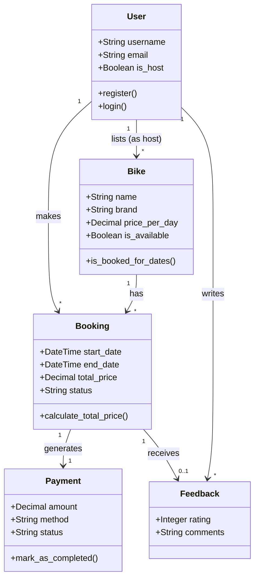

## 2. Object Modeling (Object Diagram)
**Description**: Represents a specific instance of the system at a particular moment in time.

```mermaid
objectDiagram
    object "john_doe: User" as u1 {
        username = "john_doe"
        email = "john@example.com"
        is_host = false
    }
    object "honda_activa: Bike" as b1 {
        name = "Honda Activa 6G"
        brand = "Honda"
        price_per_day = 1000.00
    }
    object "booking_101: Booking" as bk1 {
        id = 101
        start_date = "2023-10-01"
        end_date = "2023-10-05"
        total_price = 5000.00
        status = "confirmed"
    }
    object "payment_txn_99: Payment" as p1 {
        amount = 5000.00
        method = "eSewa"
        status = "completed"
    }

    u1 -- bk1 : makes
    b1 -- bk1 : booked_in
    bk1 -- p1 : paid_via
```

## 3. Dynamic Modeling (State Diagram)
**Description**: Illustrates the lifecycle of a Booking object.

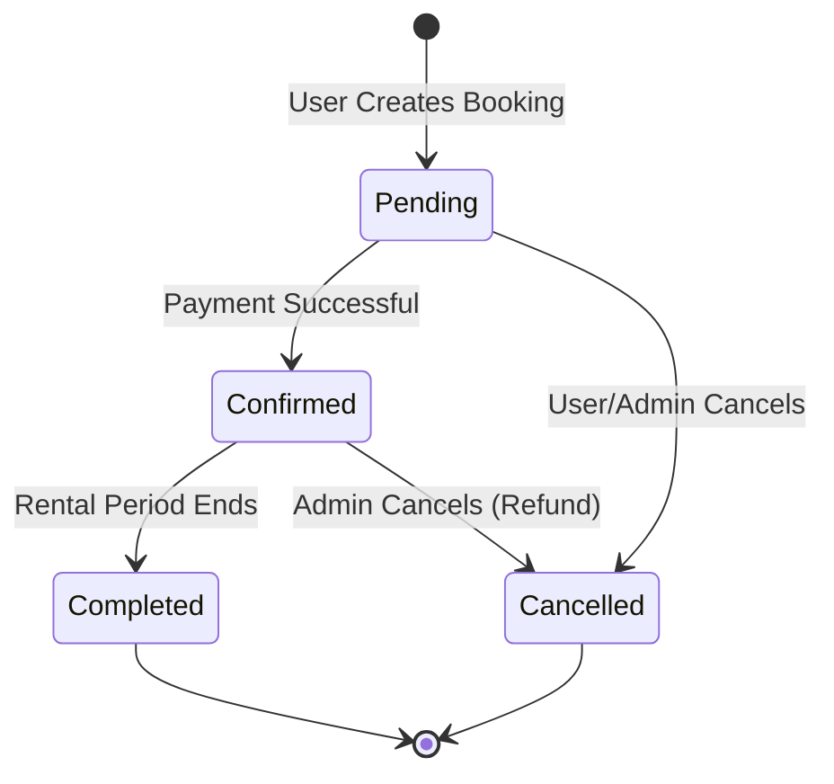

## 4. Dynamic Modeling (Sequence Diagram)
**Description**: Shows the interaction between objects/components over time during a booking process.

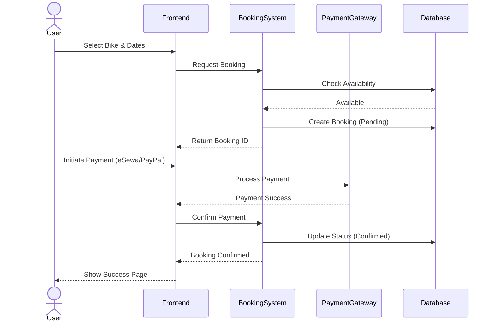

## 5. Component Diagram
**Description**: Depicts the high-level organization of the system components.

```mermaid
componentDiagram
    package "Frontend Layer" {
        [HTML Templates]
        [Static Assets (CSS/JS)]
    }
    
    package "Backend Layer (Django)" {
        [Users App]
        [Bikes App]
        [Bookings App]
        [Payment App]
        [Recommendation Engine]
        [Chatbot Module]
    }
    
    database "Data Layer" {
        [PostgreSQL Database]
        [Media Storage]
    }

    [HTML Templates] --> [Users App] : HTTP Requests
    [HTML Templates] --> [Bikes App]
    [HTML Templates] --> [Bookings App]
    
    [Users App] --> [PostgreSQL Database] : ORM
    [Bikes App] --> [PostgreSQL Database]
    [Bookings App] --> [PostgreSQL Database]
    [Payment App] --> [PostgreSQL Database]
    
    [Recommendation Engine] ..> [Bikes App] : Filters
    [Recommendation Engine] ..> [Bookings App] : Analyzes History
    [Chatbot Module] ..> [Bikes App] : Queries Info
```

## 6. Use Case Diagram
**Description**: Visualizes the interactions between actors (User, Host, Admin) and the system's use cases.

```mermaid
usecaseDiagram
    actor "User" as U
    actor "Bike Host" as H
    actor "Admin" as A

    package "Bike Rental System" {
        usecase "Register/Login" as UC1
        usecase "Browse Bikes" as UC2
        usecase "Book Bike" as UC3
        usecase "Make Payment" as UC4
        usecase "List Bike" as UC5
        usecase "Manage Bookings" as UC6
        usecase "Approve Bikes" as UC7
        usecase "Give Feedback" as UC8
        usecase "Chat with AI" as UC9
    }

    U --> UC1
    U --> UC2
    U --> UC3
    U --> UC4
    U --> UC8
    U --> UC9

    H --> UC1
    H --> UC5
    H --> UC6

    A --> UC1
    A --> UC7
    A --> UC6
```

## 7. System Flow Chart
**Description**: Represents the high-level workflow of a user booking a bike.

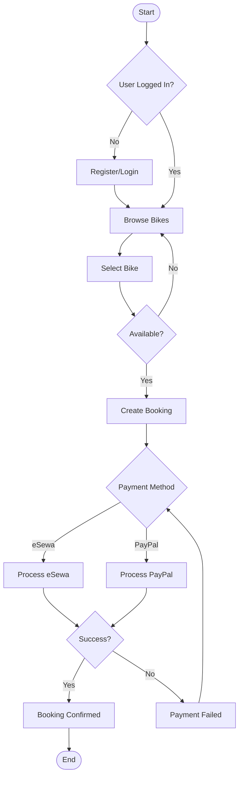

## 8. Entity-Relationship (ER) Diagram
**Description**: Shows the logical structure of the database, including entities, attributes, and relationships.

```mermaid
erDiagram
    User ||--o{ Booking : makes
    User ||--o{ Bike : owns
    User ||--o{ Feedback : writes
    User {
        int id
        string username
        string email
        boolean is_host
    }
    Bike ||--o{ Booking : has
    Bike {
        int id
        string name
        string brand
        decimal price
        boolean is_approved
    }
    Booking ||--|| Payment : generates
    Booking ||--o| Feedback : receives
    Booking {
        int id
        datetime start_date
        datetime end_date
        string status
    }
    Payment {
        int id
        decimal amount
        string method
        string status
    }
    Feedback {
        int id
        int rating
        string comment
    }

## 9. System Architecture Diagram
**Description**: High-level deployment and interaction diagram showing the system infrastructure and external integrations.

```mermaid
graph TD
    Client[User (Browser/Mobile)]
    LB[Web Server / Load Balancer]
    App[Django Application Server]
    DB[(PostgreSQL Database)]
    Media[Media Files]
    Pay1[PayPal Gateway]
    Pay2[eSewa Gateway]
    AI[Google Gemini API]

    Client -- HTTP Request --> LB
    LB -- Forward Request --> App
    App -- Query/Update --> DB
    App -- Upload/Retrieve --> Media
    App -- Payment Processing --> Pay1
    App -- Payment Processing --> Pay2
    App -- Generate Response --> AI
```
```
